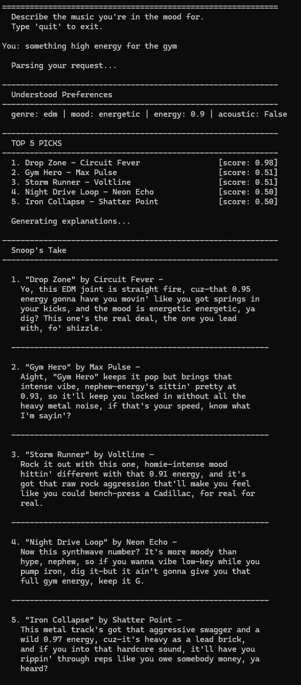
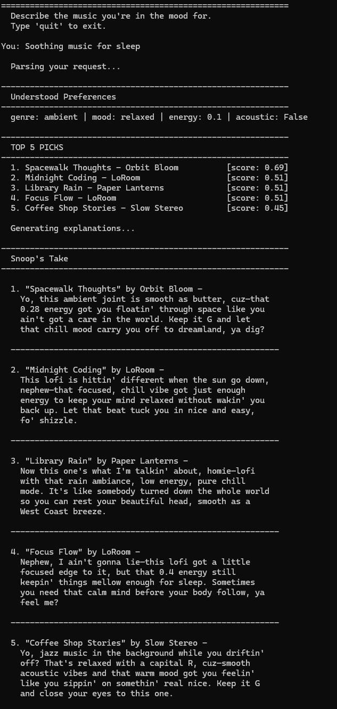
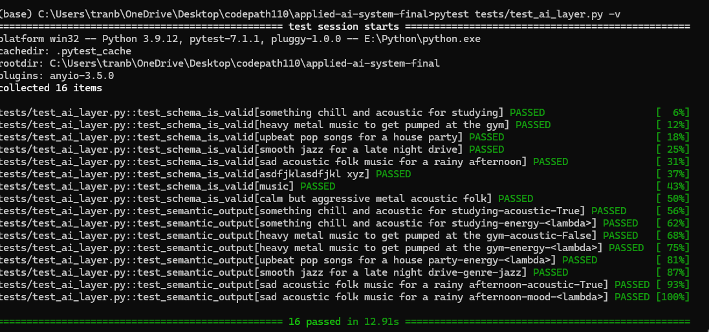

# 🎵 AI Music Recommender

> **GitHub:** [github.com/Btran206/applied-ai-system-project](https://github.com/Btran206/applied-ai-system-project/tree/main)

## Original Project

This project is an extension of the **Music Recommender Simulation**. The original system scored songs against a user's taste profile using four weighted features: genre, mood, energy, and acousticness. It then returned a ranked list of top matches. The old system functioned on hardcoded preference dictionaries and I wanted to improve on this with an AI layer.

---

## New AI Feature

This improved system uses the original recommender with a natural language interface powered by Claude. Instead of hardcoding preferences, users provide a description of the music they want in plain English. The AI layer then parses that into structured preferences dictionary, feeds them into the model, and then generates a personalized Snoop Dogg-style explanation for each recommendation.

---

## Architecture Overview

1. **`ai_layer.py`** — Handles all Claude API calls.
   - `parse_user_query(text)`: sends the user's natural language input to Claude Haiku and returns a validated JSON preferences dict (`genre`, `mood`, `energy`, `acoustic`).
   - `explain_recommendations(query, results)`: sends the top-k results back to Claude and returns a Snoop Dogg-style explanation for each song.

2. **`recommender.py`** — The scoring engine that takes a preferences dict and a song catalog, scores every song by weighted feature matches, and returns the top k results.

3. **`display.py`** — All terminal formatting including ASCII layout, column alignment, and explanation parsing.

4. **`main.py`** —  Read–Eval–Print Loop(REPL). Gets input, calls `ai_layer` → `recommender` → `ai_layer` → `display` in sequence.

**Data flow:**
```
User input (plain English)
  → parse_user_query()       [Claude Haiku]
  → structured preferences   {genre, mood, energy, acoustic}
  → recommend_songs()        [scoring]
  → top-k results            [(song, score)]
  → explain_recommendations() [Claude Haiku]
  → formatted terminal output [display.py]
```

---

## Known Biases

- Genre has a 35% weighting, so a genre match alone can outscore a song that nails mood, energy, and acousticness but has the wrong genre.
- Genre and mood proximity is partially addressed via `GENRE_CLUSTERS` and `MOOD_CLUSTERS` (adjacent genres earn 50% credit), but the clusters are manually defined and incomplete.
- Valence, danceability, and tempo aren't primary scoring features. A deeply sad song and an upbeat one score identically if their other features match, which can produce recommendations that feel tonally wrong.

---

## Getting Started

### Setup

1. Create a virtual environment (optional but recommended):

  ```bash
  python -m venv .venv
  source .venv/bin/activate      # Mac or Linux
  .venv\Scripts\activate         # Windows
  ```

2. Install dependencies:

  ```bash
  pip install -r requirements.txt
  ```

3. Set your Anthropic API key:

  ```bash
  # Mac or Linux
  export ANTHROPIC_API_KEY=your-key-here

  # Windows (Command Prompt)
  set ANTHROPIC_API_KEY=your-key-here

  # Windows (PowerShell)
  $env:ANTHROPIC_API_KEY="your-key-here"
  ```

4. Run the app:

  ```bash
  python src/main.py
  ```

### Running Tests

```bash
pytest tests/test_ai_layer.py -v
```


### Video Walkthrough
[Demo](https://www.loom.com/share/fbdeadb906284ae5924dd72bfd8bf4c1)
 
---

## Sample Interactions

### Example 1 — High Energy



### Example 2 — Low Energy



---

## Design Decisions

**Why is the recommender logic so simple?**
This is only a starter project and I wanted something that wouldn't take too much time to implement. A future iteration of this project would include a larger dataset with more features and user data. The current dataset isn't sufficient to train a complex ML pipeline.

**Why Claude Haiku for the AI calls?**
Haiku is fast and inexpensive. The input parsing prompt asks for a fixed schema JSON object which doesn't need a larger model. I also kept the Snoop Dogg responses short(1-2 sentences) which is also why Haiku is a good fit.

**Trade-offs:**
- Fixed weights (genre 35%, mood 25%, energy 25%, acoustic 15%) is not data driven. This reflects an opinion about what matters, not what users actually respond to.
- The 20 song dataset is definitely limititation for this project. A larger dataset would help with the proximity scoring and tiebreaker logic.
- Every query makes two API calls (parse + explain), so latency is noticeable. Caching parsed preferences for repeated queries would help.

---

## Testing Summary

**Evaluation script (`tests/test_recommender.py`)**

The test suite validates `parse_user_query()` across eight inputs using two layers:

- **Schema tests:** Every input — including gibberish, minimal input, and contradictory preferences — must return a dict with all four required fields, a valid genre and mood from the allowed lists, energy in `[0.0, 1.0]`, and acoustic as a boolean. These tests catch cases where the model hallucinates a field name or returns an out-of-range value.
- **Semantic tests:** Normal inputs are checked for reasonable interpretations — "chill acoustic study music" should produce `energy < 0.6` and `acoustic = True`. Failures here are warnings, not hard errors, since the model may reasonably interpret ambiguous phrasing differently.

**What worked:** Schema validation reliably catches malformed outputs.

**What didn't:** Semantic checks are inherently ambiguous. "Smooth jazz for a late night drive" sometimes comes back with `mood: melancholic` instead of `relaxed` both are valid interpretations.

**What I learned:** Testing LLM outputs is different from testing deterministic functions. Schema validation gives you a hard pass/fail boundary, but beyond that you're asserting probabilities, not guarantees.



---

## Reflection

**Using AI during development**

I used Claude as a development assistant throughout this project for prompting design, debugging, and architecture decisions. When designing `parse_user_query`, I iterated on the prompt several times to get the model to return a clean JSON. Claude also helped me work through the display formatting problems, particularly when `_print_explanation` was failing to parse the AI's output correctly. I also used claude to improve on the architecture, by suggested separating all formatting logic into `display.py` early on, which made the `main.py` way cleaner.

**Helpful suggestion:** The whole system design was basically brainstormed by claude and I just chose which one to implement.

**Flawed suggestion:** The first implementation of `_print_explanation` used a regex that didn't assume that each song entry was on its own line (`**1. "Title"**`) followed by the explanation on the next line. This caused inconsistent terminal outputs. The regex was rewritten twice and also settled on a block collection approach that handles the Claude output correctly.

**Limitations and future improvements**

The current system has two limitations worth addressing. First, the 20 song catalog is too small to give meaningful recommendations. The proximity scoring and tiebreaker logic would matter much more if I had a larger dataset. Second, the AI parsing step maps the user's input to a fixed vocabulary of genres and moods, which limits any kind of nuance in user preference. A future improvement would be to embed songs and user queries in a shared vector space instead of exact string matching.

**As an AI engineer**

This project reflects how I think about building with AI: from planning, prototyping, debugging and eventually completing a finished product, I don't just rely on AI to build the system end to end, I plan and execute with AI as an assistant. I'm also someone who thinks reliability matters from the start. The pytests were created so that I know exactly how I needed to refine the prompts for claude to get the desired outputs. That mindset, knowing where AI helps and where it adds risk, is what I want to carry into larger projects.

